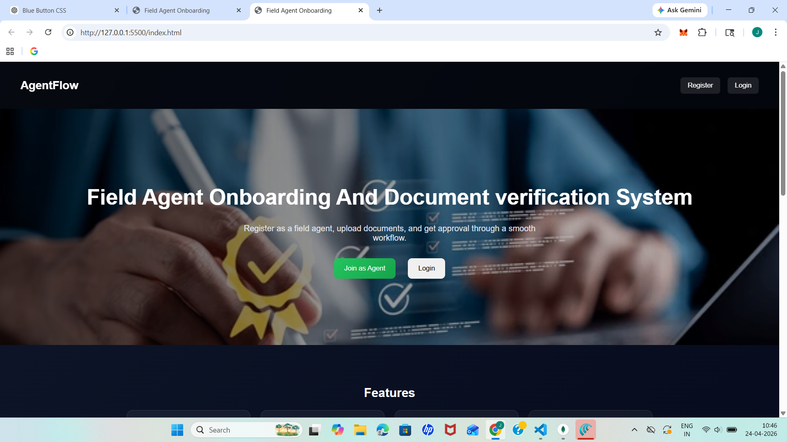
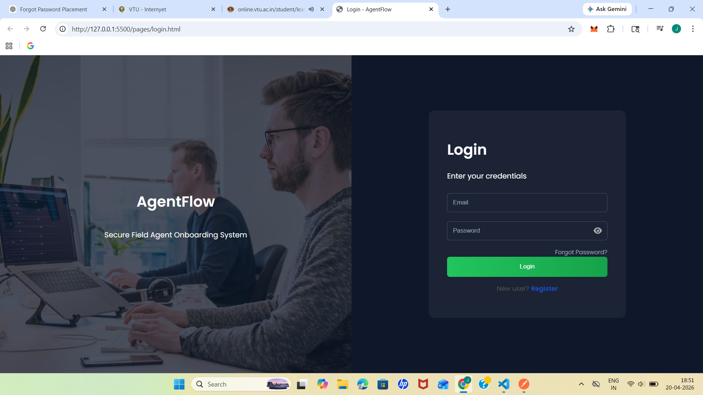
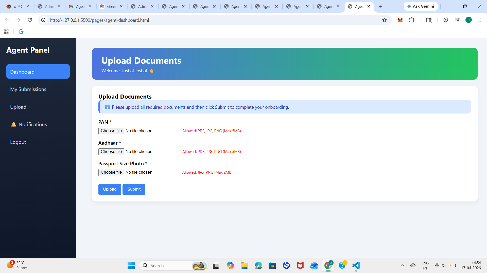
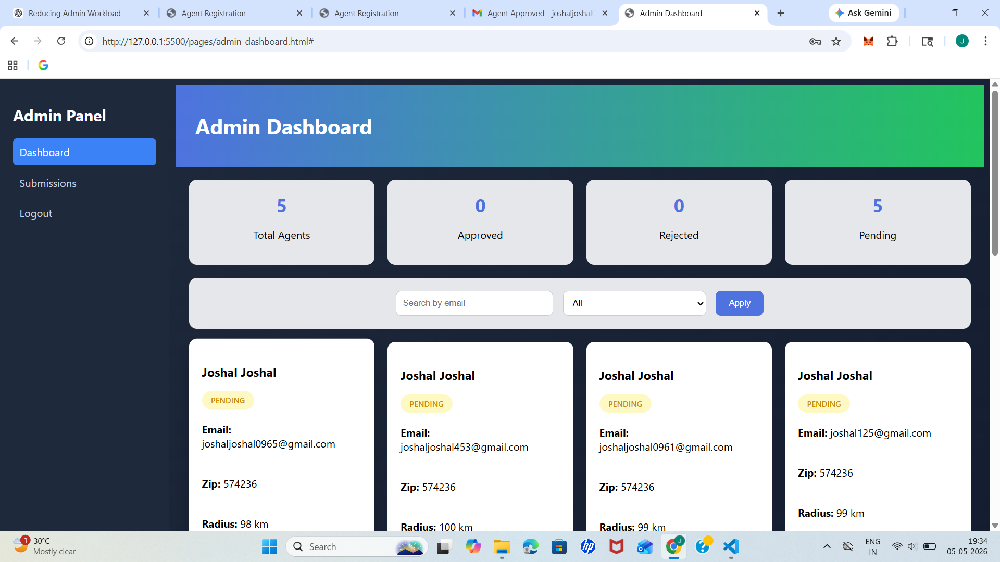

# Field Agent Onboarding and Document Verification Workflow – Frontend

## Overview

This repository contains the **frontend** of the Field Agent Onboarding and Document Verification Workflow project.

The frontend provides a user-friendly interface for field agents to register, log in, submit their details and documents, and track their verification status. It also provides an interface for administrators to review agent information and manage the document verification process.

## Key Features

* Field agent registration and login
* User-friendly onboarding process
* Agent profile and personal information management
* Document upload interface
* Document verification status tracking
* Admin dashboard for reviewing agent details
* Approve or reject document verification requests
* Integration with backend APIs
* Responsive and easy-to-use interface

## Project Workflow

1. The field agent registers or logs in to the application.
2. The agent enters the required personal and onboarding information.
3. The agent uploads the required documents.
4. The frontend sends the submitted information to the backend through APIs.
5. The administrator reviews the submitted agent details and documents.
6. Documents can be approved or rejected based on verification.
7. The field agent can view the updated verification status through the application.


## Technologies Used

- HTML5
- CSS3
- JavaScript
- REST API
- Git and GitHub


## Project Structure

```text
Frontend_Works_of_Field_Agent_Project/
│
├── css/          # Contains CSS stylesheets
├── images/       # Contains images and visual assets
├── js/           # Contains JavaScript files
├── pages/        # Contains different HTML pages
└── index.html    # Main entry page of the application
```

## Installation and Setup

### 1. Clone the Repository

```bash
git clone <your-frontend-repository-url>
```

### 2. Open the Project

Navigate to the cloned project folder.

```bash
cd Frontend_Works_of_Field_Agent_Project
```

### 3. Run the Application

Since the frontend is built using HTML, CSS, and JavaScript, no package installation is required.

Open `index.html` directly in a web browser or use the **Live Server** extension in Visual Studio Code.

### 4. Backend Connection

Make sure the backend server is running before using features such as:

- Agent registration and login
- Document submission
- Document verification
- Agent status tracking
- Admin operations

## Application Screenshots

### Home Page



### Login Page



### Agent Dashboard



### Document Upload Page


### Admin Dashboard



## Purpose of the Project

The purpose of this project is to digitize and simplify the field agent onboarding and document verification process.

The system helps organizations efficiently collect agent information, manage document submissions, verify documents, and track onboarding progress through a centralized workflow.

## Future Enhancements

* Email and SMS notifications
* Automated document verification
* Cloud-based document storage
* Improved role-based access control
* Real-time verification status updates
* Enhanced dashboard and analytics

## Author

**Joshal Fernandes**

Computer Science and Engineering
IoT with Cybersecurity and Blockchain Technology
